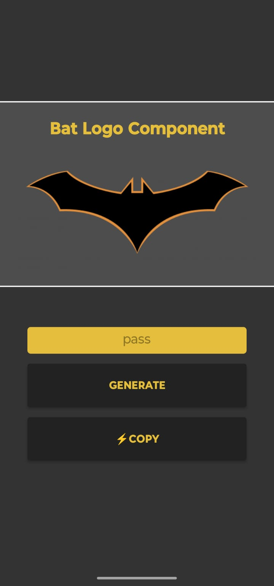
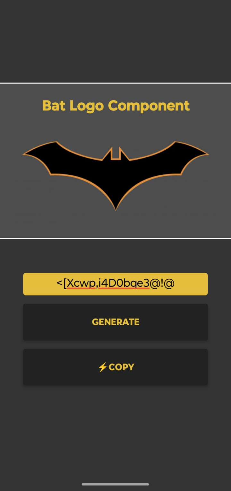

# Desafio-Sequenciador-Senhas

Este é um projeto do Bootcamp DIO para desenvolvimeento Mobile com React Native. O projeto é um simulador de gerador de senhas automáticas aleatórias, desenvolvido em React Native com Expo. O objetivo é fornecer uma interface simples e intuitiva para gerar senhas seguras de forma rápida, com a possibilidade de copiar o resultado para a área de transferência.

## Funcionalidades

- Geração de senhas aleatórias com caracteres especiais, números, letras maiúsculas e minúsculas.
- Interface temática inspirada no universo do Batman.
- Botão para copiar a senha gerada para a área de transferência.
- Layout responsivo e visual moderno.

## Telas do Aplicativo

### Tela Inicial



### Tela ao Gerar Senha



## Como executar

1. Instale as dependências:
   ```sh
   npm install
   ```
2. Inicie o projeto:
   ```sh
   npm start
   ```
3. Use o Expo Go no seu dispositivo ou emulador para visualizar o app.

---

Desafio de Simulação: um Gerador de Senhas Automático Aleatório com temática do batman.